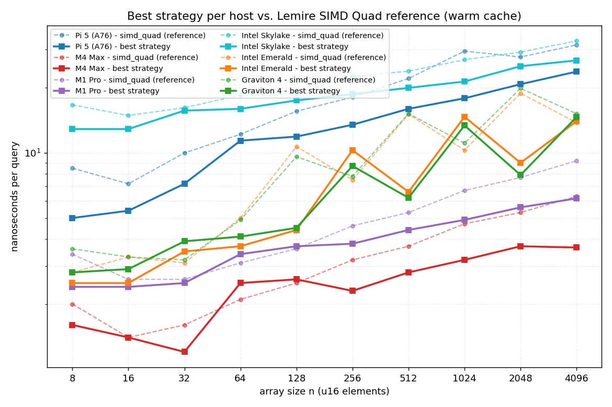
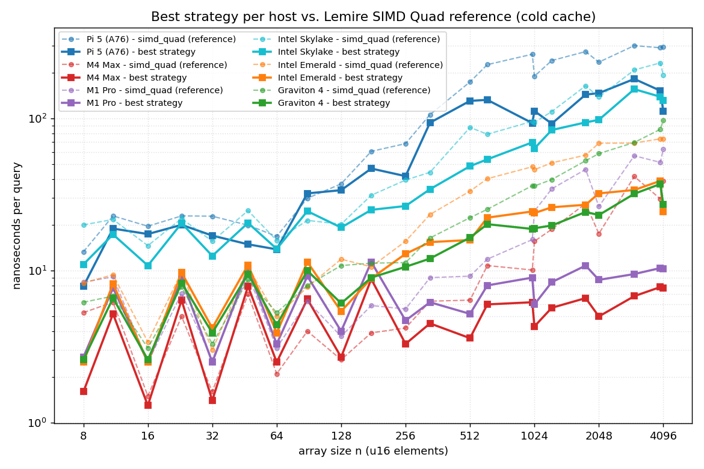

# shar-spine-quad

Machine-optimized variants of the "SIMD Quad" search for small sorted
`uint16_t` arrays (n = 1..4096, the shape used inside Roaring Bitmap
array containers), plus a two-level spine + Shar-branchless outer that
ties them together for a full 512-container × 4096-element lookup.

Six hosts, six tuned variants:

| Host | Core | Cache line | SIMD | Gap | Block check | Speculative prefetch |
|---|---|---|---|---|---|---|
| Raspberry Pi 5 | Cortex-A76 | 64 B | 128b NEON | 32 | `vld1q_u16_x2` + 2× cmp | kept (+10..25% cold win) |
| Apple M1 Pro | Firestorm | 128 B | 128b NEON | 64 | `vld1q_u16_x4` + 4× cmp | dropped |
| Apple M4 Max | M4 P-core | 128 B | 128b NEON | 64 | `vld1q_u16_x4` + 4× cmp | dropped |
| Intel Skylake-SP (8175M) | SKX | 64 B | AVX2 (zmm gated off) | 32 | 2× ymm cmpeq + movemask | kept (AVX-512 downclock) |
| Intel Emerald Rapids (8559C) | EMR | 64 B | AVX-512 + VBMI2 | 32 | 1× zmm cmpeq + kortest | dropped |
| AWS Graviton 4 | Neoverse V2 | 64 B | 128b NEON | 32 | `vld1q_u16_x2` + 4× cmp | dropped |

The headline result: a **Shar branchless outer search** combined with a
**compile-time n=4096 inner spine** (variant F in `bench_twolevel.cpp`)
wins on every host tested. On a Pi 5 full lookup, that's a ~12.9× cold
speedup over a naive two-level `std::lower_bound`.

## Quick start

```sh
./reproduce.sh          # detects host, builds, runs, diffs vs archived medians
./reproduce.sh --runs 5 # 5 runs per config, report per-cell median
./reproduce.sh --quick  # lighter 2000×2000 intensity
```

The script prints `correctness: ok` on success and shows measured vs
archived numbers side by side. It does not try to fail on mismatch, since
memory-hierarchy variance across machines of the same microarchitecture
is real and expected.

## Manual build

```sh
# Raspberry Pi 5
g++ -O3 -mcpu=cortex-a76 -std=c++20 bench.cpp \
    simd_quad_pi5.c simd_quad_m4.c simd_quad_graviton.c -o bench

# Apple M4 Max
clang++ -O3 -mcpu=apple-m4 -std=c++20 bench.cpp \
    simd_quad_pi5.c simd_quad_m4.c simd_quad_graviton.c -o bench

# Apple M1 Pro (shares simd_quad_m4.c)
clang++ -O3 -mcpu=apple-m1 -std=c++20 bench.cpp \
    simd_quad_pi5.c simd_quad_m4.c simd_quad_graviton.c -o bench

# AWS Graviton 4
g++ -O3 -mcpu=neoverse-v2 -std=c++20 bench.cpp \
    simd_quad_pi5.c simd_quad_m4.c simd_quad_graviton.c -o bench

# Intel Emerald Rapids / Ice Lake-SP / Sapphire Rapids (AVX-512 + VBMI2)
g++ -O3 -march=sapphirerapids -std=c++20 bench.cpp simd_quad_intel.c -o bench

# Intel Skylake-SP (AVX-512BW but no VBMI2; zmm block check auto-disabled)
g++ -O3 -march=native -std=c++20 bench.cpp simd_quad_intel.c -o bench
```

Then `./bench 4000 5000` for the canonical intensity.

## Files

- `simd_quad.c` — reference (SSE2 / plain NEON). Bare function body,
  `#include`d into `bench.cpp`.
- `simd_quad_pi5.c` — Cortex-A76. gap=32, paired block check, kept
  speculative prefetch, spine + compile-time n=4096 unroll.
- `simd_quad_m4.c` — Apple M4 Max **and** M1 Pro. gap=64 (one 128-B
  line), `vld1q_u16_x4` block check, no prefetch, spine + unroll.
- `simd_quad_intel.c` — Intel server. gap=32, zmm single-compare fast
  path gated on `__AVX512VBMI2__` (Ice Lake-SP+), AVX2 fallback for
  SKX. Prefetch polarity is the inverse of the zmm gate.
- `simd_quad_graviton.c` — Neoverse V2. gap=32, plain NEON (no SVE2),
  paired block check, no prefetch.
- `bench.cpp` — arch-aware correctness + bench driver. Prints one
  `4096*` A/B row per arch (one on x86, three on ARM).
- `bench_twolevel.cpp` — 512 containers × 4096 inner. Variants A–F:
  bsearch/outer-spine/Shar outer × general-n / compile-time-n=4096 inner.
- `plot.py` — inline per-host datasets (medians of 5 runs) + plot
  generator. Produces all the PNGs checked into the repo.
- `reproduce.sh` — one-shot build + bench for the current host.
- `{pi5,m4,m1,skx,emr,gv4}_runs/` — archived raw outputs and
  `compute_*.py` aggregators.

## Results at a glance

Each host's best tuned variant plotted against Lemire's reference SIMD
Quad across `n = 8..4096`, warm and cold cache. Log-log; lower is
better. The per-uarch tuning buys the most at larger `n`, and the
cold-cache gap is where the spine does most of its work.





### Single-lookup on a sorted n=4096 array (ns/op, medians of 5)

| host | warm | cold |
|---|---|---|
| M4 Max + spine | 4.3 | 6.5 |
| M1 Pro + spine | 6.3 | 11.1 |
| GV4 (Neoverse V2) + spine | 16.2 | 34.6 |
| EMR (8559C) + spine | 17.7 | 36.6 |
| Pi 5 (A76) + spine | 23.8 | 138 |
| SKX (8175M) + spine | 26.8 | 133 |

### Two-level lookup (variant A → F, ns/op, medians of 5)

| Host | A warm / cold | F warm / cold | A→F |
|---|---|---|---|
| Pi 5 | 250.8 / 426.1 | 260.5 / 33.1 | +4% / −92% |
| M4 Max | 153.6 / 22.9 | 13.6 / 7.1 | −91% / −69% |
| M1 Pro | 339.6 / 49.6 | 54.4 / 11.5 | −84% / −77% |
| SKX | 234.7 / 122.0 | 91.2 / 26.9 | −61% / −78% |
| EMR | 157.6 / 95.6 | 72.6 / 17.0 | −54% / −82% |
| GV4 | 175.8 / 85.8 | 73.7 / 14.7 | −58% / −83% |

Ship recommendation on every host: variant F (Shar outer + compile-time
n=4096 inner). Detailed findings — per-host mechanisms, what was
measured and rejected, and open items — are in the git history and the
`*_runs/` archives.

## Background

Starts from Daniel Lemire's [*You can beat the binary
search*](https://lemire.me/blog/2025/10/25/you-can-beat-the-binary-search/)
and its SIMD Quad algorithm for small sorted arrays. The goal here was
to take that starting point and tune it per uarch: where does the win
come from, where does it not, and what's the right variant to ship on
each host a Roaring Bitmap library might run on.

The branchless outer uses Leonard Shar's 1971 construction for binary
search by step-halving (`bit_floor(len)` + `len - step` offset for
non-power-of-two), which avoids the dependent pointer chase that sinks
the outer-spine variants on every host here.

## License

Code is MIT-licensed for reuse. `article.text` is a copy of Lemire's
post, retained for context; read `simd_quad.c` for the reference
starting point.
